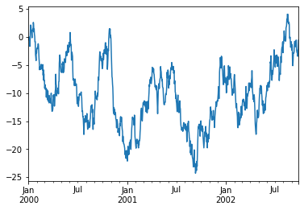
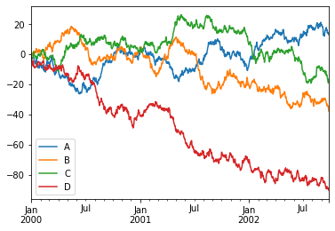

# Pandas new users

## import


```python
import numpy as np
import pandas as pd
```

# 객체 생성


```python
s = pd.Series([1,3,5,np.nan,6,8])

s
```


    0    1.0
    1    3.0
    2    5.0
    3    NaN
    4    6.0
    5    8.0
    dtype: float64


DataFrameDatetime 인덱스와 레이블이 지정된 열이 있는 Numpy 배열을 전달하여 생성


```python
dates = pd.date_range("20130101", periods=6)

dates
```


    DatetimeIndex(['2013-01-01', '2013-01-02', '2013-01-03', '2013-01-04',
                   '2013-01-05', '2013-01-06'],
                  dtype='datetime64[ns]', freq='D')


```python
df = pd.DataFrame(np.random.randn(6,4),index=dates, columns=list("ABCD"))

df
```


<div>
<style scoped>
    .dataframe tbody tr th:only-of-type {
        vertical-align: middle;
    }

    .dataframe tbody tr th {
        vertical-align: top;
    }

    .dataframe thead th {
        text-align: right;
    }
</style>
<table border="1" class="dataframe">
  <thead>
    <tr style="text-align: right;">
      <th></th>
      <th>A</th>
      <th>B</th>
      <th>C</th>
      <th>D</th>
    </tr>
  </thead>
  <tbody>
    <tr>
      <th>2013-01-01</th>
      <td>-1.338161</td>
      <td>0.110530</td>
      <td>0.536230</td>
      <td>2.030842</td>
    </tr>
    <tr>
      <th>2013-01-02</th>
      <td>0.357603</td>
      <td>-0.355747</td>
      <td>0.054411</td>
      <td>-0.102109</td>
    </tr>
    <tr>
      <th>2013-01-03</th>
      <td>-0.319073</td>
      <td>-1.183950</td>
      <td>0.094337</td>
      <td>0.616546</td>
    </tr>
    <tr>
      <th>2013-01-04</th>
      <td>0.350805</td>
      <td>1.549371</td>
      <td>1.245585</td>
      <td>-0.153351</td>
    </tr>
    <tr>
      <th>2013-01-05</th>
      <td>-0.515572</td>
      <td>-2.377644</td>
      <td>-0.042456</td>
      <td>0.071252</td>
    </tr>
    <tr>
      <th>2013-01-06</th>
      <td>-0.260635</td>
      <td>-1.106064</td>
      <td>-1.276920</td>
      <td>1.408237</td>
    </tr>
  </tbody>
</table>
</div>


DataFrame 시리즈와 같은 변환을 할 수 있는 개체의 DICT를 전달하여 만들기.


```python
df2 = pd.DataFrame(
    {
        "A" : 1.0,
        "B" : pd.Timestamp("20130102"),
        "C" : pd.Series(1, index=list(range(4)), dtype="float32"),
        "D" : np.array([3] * 4, dtype="int32"),
        "E" : pd.Categorical(["test","train","test","train"]),
        "F" : "foo"
    }
)

df2
```


<div>
<style scoped>
    .dataframe tbody tr th:only-of-type {
        vertical-align: middle;
    }

    .dataframe tbody tr th {
        vertical-align: top;
    }

    .dataframe thead th {
        text-align: right;
    }
</style>
<table border="1" class="dataframe">
  <thead>
    <tr style="text-align: right;">
      <th></th>
      <th>A</th>
      <th>B</th>
      <th>C</th>
      <th>D</th>
      <th>E</th>
      <th>F</th>
    </tr>
  </thead>
  <tbody>
    <tr>
      <th>0</th>
      <td>1.0</td>
      <td>2013-01-02</td>
      <td>1.0</td>
      <td>3</td>
      <td>test</td>
      <td>foo</td>
    </tr>
    <tr>
      <th>1</th>
      <td>1.0</td>
      <td>2013-01-02</td>
      <td>1.0</td>
      <td>3</td>
      <td>train</td>
      <td>foo</td>
    </tr>
    <tr>
      <th>2</th>
      <td>1.0</td>
      <td>2013-01-02</td>
      <td>1.0</td>
      <td>3</td>
      <td>test</td>
      <td>foo</td>
    </tr>
    <tr>
      <th>3</th>
      <td>1.0</td>
      <td>2013-01-02</td>
      <td>1.0</td>
      <td>3</td>
      <td>train</td>
      <td>foo</td>
    </tr>
  </tbody>
</table>
</div>


그 결과 열 DataFrame은 다른 dtypes를 갖습니다.


```python
df2.dtypes
```


    A    float64
    B    float64
    dtype: object


# 데이터 보기

프레임의 상단 및 하단 행을 보는 방법


```python
df.head()
```


<div>
<style scoped>
    .dataframe tbody tr th:only-of-type {
        vertical-align: middle;
    }

    .dataframe tbody tr th {
        vertical-align: top;
    }

    .dataframe thead th {
        text-align: right;
    }
</style>
<table border="1" class="dataframe">
  <thead>
    <tr style="text-align: right;">
      <th></th>
      <th>A</th>
      <th>B</th>
      <th>C</th>
      <th>D</th>
    </tr>
  </thead>
  <tbody>
    <tr>
      <th>2013-01-01</th>
      <td>-1.338161</td>
      <td>0.110530</td>
      <td>0.536230</td>
      <td>2.030842</td>
    </tr>
    <tr>
      <th>2013-01-02</th>
      <td>0.357603</td>
      <td>-0.355747</td>
      <td>0.054411</td>
      <td>-0.102109</td>
    </tr>
    <tr>
      <th>2013-01-03</th>
      <td>-0.319073</td>
      <td>-1.183950</td>
      <td>0.094337</td>
      <td>0.616546</td>
    </tr>
    <tr>
      <th>2013-01-04</th>
      <td>0.350805</td>
      <td>1.549371</td>
      <td>1.245585</td>
      <td>-0.153351</td>
    </tr>
    <tr>
      <th>2013-01-05</th>
      <td>-0.515572</td>
      <td>-2.377644</td>
      <td>-0.042456</td>
      <td>0.071252</td>
    </tr>
  </tbody>
</table>
</div>


```python
df.tail(3)
```


<div>
<style scoped>
    .dataframe tbody tr th:only-of-type {
        vertical-align: middle;
    }

    .dataframe tbody tr th {
        vertical-align: top;
    }

    .dataframe thead th {
        text-align: right;
    }
</style>
<table border="1" class="dataframe">
  <thead>
    <tr style="text-align: right;">
      <th></th>
      <th>A</th>
      <th>B</th>
      <th>C</th>
      <th>D</th>
    </tr>
  </thead>
  <tbody>
    <tr>
      <th>2013-01-04</th>
      <td>0.350805</td>
      <td>1.549371</td>
      <td>1.245585</td>
      <td>-0.153351</td>
    </tr>
    <tr>
      <th>2013-01-05</th>
      <td>-0.515572</td>
      <td>-2.377644</td>
      <td>-0.042456</td>
      <td>0.071252</td>
    </tr>
    <tr>
      <th>2013-01-06</th>
      <td>-0.260635</td>
      <td>-1.106064</td>
      <td>-1.276920</td>
      <td>1.408237</td>
    </tr>
  </tbody>
</table>
</div>


색인, 열 표시


```python
df.index
```


    DatetimeIndex(['2013-01-01', '2013-01-02', '2013-01-03', '2013-01-04',
                   '2013-01-05', '2013-01-06'],
                  dtype='datetime64[ns]', freq='D')


```python
df.columns
```


    Index(['A', 'B', 'C', 'D'], dtype='object')


DataFrame.to_numpy()기본 데이터의 Numpy 표현을 제공합니다. DataFrame pandas와 Numpy의 근본적인 차이로 인해 데이터 유형이 다른 열이 있는 경우 이 작업은 비용이 많이들 수 있습니다.
Numpy 배열에는 전체 배열에 대해 하나의 dtype이 있는 반면 pandas DataFrames에는 열당 하나의 dtype이 있습니다. DataFrame.to_numpy()를 호출하면 pandas는 DataFrame의 모든 dtype을 보유할 수 있는 Numpy dtype을 찾습니다. 결국 object 모든 값을 python 객체로 캐스팅해야 하는식으로 끝날 수 있습니다.

df에 대한, DataFrame 모든 부동 소수점 값, DataFrame.to_numpy() 빠르고 및 복사 데이터를 필요로 하지 않는다.


```python
df.to_numpy()
```


    array([[-1.33816087,  0.11053004,  0.53623007,  2.03084207],
           [ 0.35760296, -0.35574745,  0.0544108 , -0.10210902],
           [-0.31907276, -1.18395015,  0.09433678,  0.61654553],
           [ 0.35080472,  1.54937131,  1.24558483, -0.15335078],
           [-0.51557247, -2.37764397, -0.04245553,  0.07125205],
           [-0.26063518, -1.10606377, -1.27691993,  1.40823689]])


df2는 DataFrame 여러 dtype으로, DataFrame.to_numpy() 상대적으로 비싸다.


```python
df2.to_numpy()
```


    array([[-0.37591379,  0.80689645],
           [ 2.71741139, -1.18659735],
           [ 0.34445035,  0.15736656],
           [ 0.21151164,  0.70306021]])


DataFrame.to_numpy()출력에 색인 또는 열 레이블을 포함 하지 않습니다.

describe() 데이터에 대한 빠른 통계 요약을 보여줍니다.


```python
df.describe()
```


<div>
<style scoped>
    .dataframe tbody tr th:only-of-type {
        vertical-align: middle;
    }

    .dataframe tbody tr th {
        vertical-align: top;
    }

    .dataframe thead th {
        text-align: right;
    }
</style>
<table border="1" class="dataframe">
  <thead>
    <tr style="text-align: right;">
      <th></th>
      <th>A</th>
      <th>B</th>
      <th>C</th>
      <th>D</th>
    </tr>
  </thead>
  <tbody>
    <tr>
      <th>count</th>
      <td>6.000000</td>
      <td>6.000000</td>
      <td>6.000000</td>
      <td>6.000000</td>
    </tr>
    <tr>
      <th>mean</th>
      <td>-0.287506</td>
      <td>-0.560584</td>
      <td>0.101865</td>
      <td>0.645236</td>
    </tr>
    <tr>
      <th>std</th>
      <td>0.629478</td>
      <td>1.336571</td>
      <td>0.827158</td>
      <td>0.897621</td>
    </tr>
    <tr>
      <th>min</th>
      <td>-1.338161</td>
      <td>-2.377644</td>
      <td>-1.276920</td>
      <td>-0.153351</td>
    </tr>
    <tr>
      <th>25%</th>
      <td>-0.466448</td>
      <td>-1.164479</td>
      <td>-0.018239</td>
      <td>-0.058769</td>
    </tr>
    <tr>
      <th>50%</th>
      <td>-0.289854</td>
      <td>-0.730906</td>
      <td>0.074374</td>
      <td>0.343899</td>
    </tr>
    <tr>
      <th>75%</th>
      <td>0.197945</td>
      <td>-0.006039</td>
      <td>0.425757</td>
      <td>1.210314</td>
    </tr>
    <tr>
      <th>max</th>
      <td>0.357603</td>
      <td>1.549371</td>
      <td>1.245585</td>
      <td>2.030842</td>
    </tr>
  </tbody>
</table>
</div>


데이터 전치 : 


```python
df.T
```


<div>
<style scoped>
    .dataframe tbody tr th:only-of-type {
        vertical-align: middle;
    }

    .dataframe tbody tr th {
        vertical-align: top;
    }

    .dataframe thead th {
        text-align: right;
    }
</style>
<table border="1" class="dataframe">
  <thead>
    <tr style="text-align: right;">
      <th></th>
      <th>2013-01-01</th>
      <th>2013-01-02</th>
      <th>2013-01-03</th>
      <th>2013-01-04</th>
      <th>2013-01-05</th>
      <th>2013-01-06</th>
    </tr>
  </thead>
  <tbody>
    <tr>
      <th>A</th>
      <td>-1.338161</td>
      <td>0.357603</td>
      <td>-0.319073</td>
      <td>0.350805</td>
      <td>-0.515572</td>
      <td>-0.260635</td>
    </tr>
    <tr>
      <th>B</th>
      <td>0.110530</td>
      <td>-0.355747</td>
      <td>-1.183950</td>
      <td>1.549371</td>
      <td>-2.377644</td>
      <td>-1.106064</td>
    </tr>
    <tr>
      <th>C</th>
      <td>0.536230</td>
      <td>0.054411</td>
      <td>0.094337</td>
      <td>1.245585</td>
      <td>-0.042456</td>
      <td>-1.276920</td>
    </tr>
    <tr>
      <th>D</th>
      <td>2.030842</td>
      <td>-0.102109</td>
      <td>0.616546</td>
      <td>-0.153351</td>
      <td>0.071252</td>
      <td>1.408237</td>
    </tr>
  </tbody>
</table>
</div>


축으로 정렬 : 


```python
df.sort_index(axis=1, ascending=False)
```


<div>
<style scoped>
    .dataframe tbody tr th:only-of-type {
        vertical-align: middle;
    }

    .dataframe tbody tr th {
        vertical-align: top;
    }

    .dataframe thead th {
        text-align: right;
    }
</style>
<table border="1" class="dataframe">
  <thead>
    <tr style="text-align: right;">
      <th></th>
      <th>D</th>
      <th>C</th>
      <th>B</th>
      <th>A</th>
    </tr>
  </thead>
  <tbody>
    <tr>
      <th>2013-01-01</th>
      <td>2.030842</td>
      <td>0.536230</td>
      <td>0.110530</td>
      <td>-1.338161</td>
    </tr>
    <tr>
      <th>2013-01-02</th>
      <td>-0.102109</td>
      <td>0.054411</td>
      <td>-0.355747</td>
      <td>0.357603</td>
    </tr>
    <tr>
      <th>2013-01-03</th>
      <td>0.616546</td>
      <td>0.094337</td>
      <td>-1.183950</td>
      <td>-0.319073</td>
    </tr>
    <tr>
      <th>2013-01-04</th>
      <td>-0.153351</td>
      <td>1.245585</td>
      <td>1.549371</td>
      <td>0.350805</td>
    </tr>
    <tr>
      <th>2013-01-05</th>
      <td>0.071252</td>
      <td>-0.042456</td>
      <td>-2.377644</td>
      <td>-0.515572</td>
    </tr>
    <tr>
      <th>2013-01-06</th>
      <td>1.408237</td>
      <td>-1.276920</td>
      <td>-1.106064</td>
      <td>-0.260635</td>
    </tr>
  </tbody>
</table>
</div>


값으로 정렬 : 


```python
df.sort_values(by="B")
```


<div>
<style scoped>
    .dataframe tbody tr th:only-of-type {
        vertical-align: middle;
    }

    .dataframe tbody tr th {
        vertical-align: top;
    }

    .dataframe thead th {
        text-align: right;
    }
</style>
<table border="1" class="dataframe">
  <thead>
    <tr style="text-align: right;">
      <th></th>
      <th>A</th>
      <th>B</th>
      <th>C</th>
      <th>D</th>
    </tr>
  </thead>
  <tbody>
    <tr>
      <th>2013-01-05</th>
      <td>-0.515572</td>
      <td>-2.377644</td>
      <td>-0.042456</td>
      <td>0.071252</td>
    </tr>
    <tr>
      <th>2013-01-03</th>
      <td>-0.319073</td>
      <td>-1.183950</td>
      <td>0.094337</td>
      <td>0.616546</td>
    </tr>
    <tr>
      <th>2013-01-06</th>
      <td>-0.260635</td>
      <td>-1.106064</td>
      <td>-1.276920</td>
      <td>1.408237</td>
    </tr>
    <tr>
      <th>2013-01-02</th>
      <td>0.357603</td>
      <td>-0.355747</td>
      <td>0.054411</td>
      <td>-0.102109</td>
    </tr>
    <tr>
      <th>2013-01-01</th>
      <td>-1.338161</td>
      <td>0.110530</td>
      <td>0.536230</td>
      <td>2.030842</td>
    </tr>
    <tr>
      <th>2013-01-04</th>
      <td>0.350805</td>
      <td>1.549371</td>
      <td>1.245585</td>
      <td>-0.153351</td>
    </tr>
  </tbody>
</table>
</div>


## 선택
- 선택 및 설정을 위한 표준 python / Numpy 표현식은 직관적이고 대화형 작업에 유용하지만 프로덕션 코드의 경우 최적화 된 pandas 데이터 액세스 방법 .at인 .iat, .loc및 .lioc.

## 얻기
단일 열을 선택하면 다음 Series와 같은 결과가 생성됩니다.


```python
df["A"]
```


    2013-01-01   -1.338161
    2013-01-02    0.357603
    2013-01-03   -0.319073
    2013-01-04    0.350805
    2013-01-05   -0.515572
    2013-01-06   -0.260635
    Freq: D, Name: A, dtype: float64


[]행을 분할하는 via를 선택합니다.


```python
df[0:3]
```


<div>
<style scoped>
    .dataframe tbody tr th:only-of-type {
        vertical-align: middle;
    }

    .dataframe tbody tr th {
        vertical-align: top;
    }

    .dataframe thead th {
        text-align: right;
    }
</style>
<table border="1" class="dataframe">
  <thead>
    <tr style="text-align: right;">
      <th></th>
      <th>A</th>
      <th>B</th>
      <th>C</th>
      <th>D</th>
    </tr>
  </thead>
  <tbody>
    <tr>
      <th>2013-01-01</th>
      <td>-1.338161</td>
      <td>0.110530</td>
      <td>0.536230</td>
      <td>2.030842</td>
    </tr>
    <tr>
      <th>2013-01-02</th>
      <td>0.357603</td>
      <td>-0.355747</td>
      <td>0.054411</td>
      <td>-0.102109</td>
    </tr>
    <tr>
      <th>2013-01-03</th>
      <td>-0.319073</td>
      <td>-1.183950</td>
      <td>0.094337</td>
      <td>0.616546</td>
    </tr>
  </tbody>
</table>
</div>


```python
df["20130102":"20130104"]
```


<div>
<style scoped>
    .dataframe tbody tr th:only-of-type {
        vertical-align: middle;
    }

    .dataframe tbody tr th {
        vertical-align: top;
    }

    .dataframe thead th {
        text-align: right;
    }
</style>
<table border="1" class="dataframe">
  <thead>
    <tr style="text-align: right;">
      <th></th>
      <th>A</th>
      <th>B</th>
      <th>C</th>
      <th>D</th>
    </tr>
  </thead>
  <tbody>
    <tr>
      <th>2013-01-02</th>
      <td>0.357603</td>
      <td>-0.355747</td>
      <td>0.054411</td>
      <td>-0.102109</td>
    </tr>
    <tr>
      <th>2013-01-03</th>
      <td>-0.319073</td>
      <td>-1.183950</td>
      <td>0.094337</td>
      <td>0.616546</td>
    </tr>
    <tr>
      <th>2013-01-04</th>
      <td>0.350805</td>
      <td>1.549371</td>
      <td>1.245585</td>
      <td>-0.153351</td>
    </tr>
  </tbody>
</table>
</div>


## 라벨로 선택
레이블을 사용하여 횡단면을 얻으려면 : 


```python
df.loc[dates[0]]
```


    A   -1.338161
    B    0.110530
    C    0.536230
    D    2.030842
    Name: 2013-01-01 00:00:00, dtype: float64


라벨로 다축 선택 : 


```python
df.loc[:,["A","B"]]
```


<div>
<style scoped>
    .dataframe tbody tr th:only-of-type {
        vertical-align: middle;
    }

    .dataframe tbody tr th {
        vertical-align: top;
    }

    .dataframe thead th {
        text-align: right;
    }
</style>
<table border="1" class="dataframe">
  <thead>
    <tr style="text-align: right;">
      <th></th>
      <th>A</th>
      <th>B</th>
    </tr>
  </thead>
  <tbody>
    <tr>
      <th>2013-01-01</th>
      <td>-1.338161</td>
      <td>0.110530</td>
    </tr>
    <tr>
      <th>2013-01-02</th>
      <td>0.357603</td>
      <td>-0.355747</td>
    </tr>
    <tr>
      <th>2013-01-03</th>
      <td>-0.319073</td>
      <td>-1.183950</td>
    </tr>
    <tr>
      <th>2013-01-04</th>
      <td>0.350805</td>
      <td>1.549371</td>
    </tr>
    <tr>
      <th>2013-01-05</th>
      <td>-0.515572</td>
      <td>-2.377644</td>
    </tr>
    <tr>
      <th>2013-01-06</th>
      <td>-0.260635</td>
      <td>-1.106064</td>
    </tr>
  </tbody>
</table>
</div>


레이블 슬라이싱을 표시하며 두 엔드 포인트가 모두 포함됩니다.


```python
df.loc["20130102":"20130104",["A","B"]]
```


<div>
<style scoped>
    .dataframe tbody tr th:only-of-type {
        vertical-align: middle;
    }

    .dataframe tbody tr th {
        vertical-align: top;
    }

    .dataframe thead th {
        text-align: right;
    }
</style>
<table border="1" class="dataframe">
  <thead>
    <tr style="text-align: right;">
      <th></th>
      <th>A</th>
      <th>B</th>
    </tr>
  </thead>
  <tbody>
    <tr>
      <th>2013-01-02</th>
      <td>0.357603</td>
      <td>-0.355747</td>
    </tr>
    <tr>
      <th>2013-01-03</th>
      <td>-0.319073</td>
      <td>-1.183950</td>
    </tr>
    <tr>
      <th>2013-01-04</th>
      <td>0.350805</td>
      <td>1.549371</td>
    </tr>
  </tbody>
</table>
</div>


반환 된 객체의 크기 감소 : 


```python
df.loc["20130102",["A","B"]]
```


    A    0.357603
    B   -0.355747
    Name: 2013-01-02 00:00:00, dtype: float64


스칼라 값을 얻으려면 : 


```python
df.loc[dates[0], "A"]
```


    -1.3381608728638592


스칼라에 빠르게 액세스하려면 : 


```python
df.at[dates[0], "A"]
```


    -1.3381608728638592


## 위치 별 선택

전달 된 정수의 위치를 통해 선택 : 


```python
df.iloc[3]
```


    A    0.350805
    B    1.549371
    C    1.245585
    D   -0.153351
    Name: 2013-01-04 00:00:00, dtype: float64


정수 조각으로 numpy / python과 유사하게 작동합니다.


```python
df.iloc[3:5, 0:2]
```


<div>
<style scoped>
    .dataframe tbody tr th:only-of-type {
        vertical-align: middle;
    }

    .dataframe tbody tr th {
        vertical-align: top;
    }

    .dataframe thead th {
        text-align: right;
    }
</style>
<table border="1" class="dataframe">
  <thead>
    <tr style="text-align: right;">
      <th></th>
      <th>A</th>
      <th>B</th>
    </tr>
  </thead>
  <tbody>
    <tr>
      <th>2013-01-04</th>
      <td>0.350805</td>
      <td>1.549371</td>
    </tr>
    <tr>
      <th>2013-01-05</th>
      <td>-0.515572</td>
      <td>-2.377644</td>
    </tr>
  </tbody>
</table>
</div>


Numpy / python 스타일과 유사한 정수 위치 목록 : 


```python
df.iloc[[1,2,4],[0,2]]
```


<div>
<style scoped>
    .dataframe tbody tr th:only-of-type {
        vertical-align: middle;
    }

    .dataframe tbody tr th {
        vertical-align: top;
    }

    .dataframe thead th {
        text-align: right;
    }
</style>
<table border="1" class="dataframe">
  <thead>
    <tr style="text-align: right;">
      <th></th>
      <th>A</th>
      <th>C</th>
    </tr>
  </thead>
  <tbody>
    <tr>
      <th>2013-01-02</th>
      <td>0.357603</td>
      <td>0.054411</td>
    </tr>
    <tr>
      <th>2013-01-03</th>
      <td>-0.319073</td>
      <td>0.094337</td>
    </tr>
    <tr>
      <th>2013-01-05</th>
      <td>-0.515572</td>
      <td>-0.042456</td>
    </tr>
  </tbody>
</table>
</div>


행을 명시적으로 분할하려면 : 


```python
df.iloc[1:3,:]
```


<div>
<style scoped>
    .dataframe tbody tr th:only-of-type {
        vertical-align: middle;
    }

    .dataframe tbody tr th {
        vertical-align: top;
    }

    .dataframe thead th {
        text-align: right;
    }
</style>
<table border="1" class="dataframe">
  <thead>
    <tr style="text-align: right;">
      <th></th>
      <th>A</th>
      <th>B</th>
      <th>C</th>
      <th>D</th>
    </tr>
  </thead>
  <tbody>
    <tr>
      <th>2013-01-02</th>
      <td>0.357603</td>
      <td>-0.355747</td>
      <td>0.054411</td>
      <td>-0.102109</td>
    </tr>
    <tr>
      <th>2013-01-03</th>
      <td>-0.319073</td>
      <td>-1.183950</td>
      <td>0.094337</td>
      <td>0.616546</td>
    </tr>
  </tbody>
</table>
</div>


열을 명시적으로 분할하려면 다음을 수행하십시오.


```python
df.iloc[:,1:3]
```


<div>
<style scoped>
    .dataframe tbody tr th:only-of-type {
        vertical-align: middle;
    }

    .dataframe tbody tr th {
        vertical-align: top;
    }

    .dataframe thead th {
        text-align: right;
    }
</style>
<table border="1" class="dataframe">
  <thead>
    <tr style="text-align: right;">
      <th></th>
      <th>B</th>
      <th>C</th>
    </tr>
  </thead>
  <tbody>
    <tr>
      <th>2013-01-01</th>
      <td>0.110530</td>
      <td>0.536230</td>
    </tr>
    <tr>
      <th>2013-01-02</th>
      <td>-0.355747</td>
      <td>0.054411</td>
    </tr>
    <tr>
      <th>2013-01-03</th>
      <td>-1.183950</td>
      <td>0.094337</td>
    </tr>
    <tr>
      <th>2013-01-04</th>
      <td>1.549371</td>
      <td>1.245585</td>
    </tr>
    <tr>
      <th>2013-01-05</th>
      <td>-2.377644</td>
      <td>-0.042456</td>
    </tr>
    <tr>
      <th>2013-01-06</th>
      <td>-1.106064</td>
      <td>-1.276920</td>
    </tr>
  </tbody>
</table>
</div>


명시적으로 값을 얻으려면 :


```python
df.iloc[1,1]
```


    -0.3557474474984722


스칼라에 빠르게 액세스하려면 : 


```python
df.iat[1,1]
```


    -0.3557474474984722


# 불 인덱싱

단일 열의 값을 사용하여 데이터를 선택합니다.


```python
df[df["A"]>0]
```


<div>
<style scoped>
    .dataframe tbody tr th:only-of-type {
        vertical-align: middle;
    }

    .dataframe tbody tr th {
        vertical-align: top;
    }

    .dataframe thead th {
        text-align: right;
    }
</style>
<table border="1" class="dataframe">
  <thead>
    <tr style="text-align: right;">
      <th></th>
      <th>A</th>
      <th>B</th>
      <th>C</th>
      <th>D</th>
    </tr>
  </thead>
  <tbody>
    <tr>
      <th>2013-01-02</th>
      <td>0.357603</td>
      <td>-0.355747</td>
      <td>0.054411</td>
      <td>-0.102109</td>
    </tr>
    <tr>
      <th>2013-01-04</th>
      <td>0.350805</td>
      <td>1.549371</td>
      <td>1.245585</td>
      <td>-0.153351</td>
    </tr>
  </tbody>
</table>
</div>


불 조건이 충족되는 DataFrame에서 값 선택


```python
df[df > 0]
```


<div>
<style scoped>
    .dataframe tbody tr th:only-of-type {
        vertical-align: middle;
    }

    .dataframe tbody tr th {
        vertical-align: top;
    }

    .dataframe thead th {
        text-align: right;
    }
</style>
<table border="1" class="dataframe">
  <thead>
    <tr style="text-align: right;">
      <th></th>
      <th>A</th>
      <th>B</th>
      <th>C</th>
      <th>D</th>
    </tr>
  </thead>
  <tbody>
    <tr>
      <th>2013-01-01</th>
      <td>NaN</td>
      <td>0.110530</td>
      <td>0.536230</td>
      <td>2.030842</td>
    </tr>
    <tr>
      <th>2013-01-02</th>
      <td>0.357603</td>
      <td>NaN</td>
      <td>0.054411</td>
      <td>NaN</td>
    </tr>
    <tr>
      <th>2013-01-03</th>
      <td>NaN</td>
      <td>NaN</td>
      <td>0.094337</td>
      <td>0.616546</td>
    </tr>
    <tr>
      <th>2013-01-04</th>
      <td>0.350805</td>
      <td>1.549371</td>
      <td>1.245585</td>
      <td>NaN</td>
    </tr>
    <tr>
      <th>2013-01-05</th>
      <td>NaN</td>
      <td>NaN</td>
      <td>NaN</td>
      <td>0.071252</td>
    </tr>
    <tr>
      <th>2013-01-06</th>
      <td>NaN</td>
      <td>NaN</td>
      <td>NaN</td>
      <td>1.408237</td>
    </tr>
  </tbody>
</table>
</div>


isin()필터링 방법 사용 : 


```python
df2 = df.copy()

df2["E"] = ["one", "one", "two", "three", "four", "three"]

df2
```


<div>
<style scoped>
    .dataframe tbody tr th:only-of-type {
        vertical-align: middle;
    }

    .dataframe tbody tr th {
        vertical-align: top;
    }

    .dataframe thead th {
        text-align: right;
    }
</style>
<table border="1" class="dataframe">
  <thead>
    <tr style="text-align: right;">
      <th></th>
      <th>A</th>
      <th>B</th>
      <th>C</th>
      <th>D</th>
      <th>E</th>
    </tr>
  </thead>
  <tbody>
    <tr>
      <th>2013-01-01</th>
      <td>-1.338161</td>
      <td>0.110530</td>
      <td>0.536230</td>
      <td>2.030842</td>
      <td>one</td>
    </tr>
    <tr>
      <th>2013-01-02</th>
      <td>0.357603</td>
      <td>-0.355747</td>
      <td>0.054411</td>
      <td>-0.102109</td>
      <td>one</td>
    </tr>
    <tr>
      <th>2013-01-03</th>
      <td>-0.319073</td>
      <td>-1.183950</td>
      <td>0.094337</td>
      <td>0.616546</td>
      <td>two</td>
    </tr>
    <tr>
      <th>2013-01-04</th>
      <td>0.350805</td>
      <td>1.549371</td>
      <td>1.245585</td>
      <td>-0.153351</td>
      <td>three</td>
    </tr>
    <tr>
      <th>2013-01-05</th>
      <td>-0.515572</td>
      <td>-2.377644</td>
      <td>-0.042456</td>
      <td>0.071252</td>
      <td>four</td>
    </tr>
    <tr>
      <th>2013-01-06</th>
      <td>-0.260635</td>
      <td>-1.106064</td>
      <td>-1.276920</td>
      <td>1.408237</td>
      <td>three</td>
    </tr>
  </tbody>
</table>
</div>


# 설정

새 열을 설정하면 인덱스별로 데이터가 자동으로 정렬됩니다.


```python
s1 = pd.Series([1,2,3,4,5,6], index=pd.date_range("20130102", periods=6))

s1

df["F"] = s1
```

라벨 별 설정 값:


```python
df.at[dates[0], "A"] = 0
```

위치 별 설정 값 :


```python
df.iat[0,1]=0
```

Numpy 배열로 할당하여 설정:


```python
df.loc[:, "D"] = np.array([5] * len(df))
```

이전 설정 작업의 결과 :


```python
df
```


<div>
<style scoped>
    .dataframe tbody tr th:only-of-type {
        vertical-align: middle;
    }

    .dataframe tbody tr th {
        vertical-align: top;
    }

    .dataframe thead th {
        text-align: right;
    }
</style>
<table border="1" class="dataframe">
  <thead>
    <tr style="text-align: right;">
      <th></th>
      <th>A</th>
      <th>B</th>
      <th>C</th>
      <th>D</th>
      <th>F</th>
    </tr>
  </thead>
  <tbody>
    <tr>
      <th>2013-01-01</th>
      <td>0.000000</td>
      <td>0.000000</td>
      <td>0.536230</td>
      <td>5</td>
      <td>NaN</td>
    </tr>
    <tr>
      <th>2013-01-02</th>
      <td>0.357603</td>
      <td>-0.355747</td>
      <td>0.054411</td>
      <td>5</td>
      <td>1.0</td>
    </tr>
    <tr>
      <th>2013-01-03</th>
      <td>-0.319073</td>
      <td>-1.183950</td>
      <td>0.094337</td>
      <td>5</td>
      <td>2.0</td>
    </tr>
    <tr>
      <th>2013-01-04</th>
      <td>0.350805</td>
      <td>1.549371</td>
      <td>1.245585</td>
      <td>5</td>
      <td>3.0</td>
    </tr>
    <tr>
      <th>2013-01-05</th>
      <td>-0.515572</td>
      <td>-2.377644</td>
      <td>-0.042456</td>
      <td>5</td>
      <td>4.0</td>
    </tr>
    <tr>
      <th>2013-01-06</th>
      <td>-0.260635</td>
      <td>-1.106064</td>
      <td>-1.276920</td>
      <td>5</td>
      <td>5.0</td>
    </tr>
  </tbody>
</table>
</div>


where 설정이 있는 작업


```python
df2 = df.copy()

df2[df2 > 0] = -df2

df2
```


<div>
<style scoped>
    .dataframe tbody tr th:only-of-type {
        vertical-align: middle;
    }

    .dataframe tbody tr th {
        vertical-align: top;
    }

    .dataframe thead th {
        text-align: right;
    }
</style>
<table border="1" class="dataframe">
  <thead>
    <tr style="text-align: right;">
      <th></th>
      <th>A</th>
      <th>B</th>
      <th>C</th>
      <th>D</th>
      <th>F</th>
    </tr>
  </thead>
  <tbody>
    <tr>
      <th>2013-01-01</th>
      <td>0.000000</td>
      <td>0.000000</td>
      <td>-0.536230</td>
      <td>-5</td>
      <td>NaN</td>
    </tr>
    <tr>
      <th>2013-01-02</th>
      <td>-0.357603</td>
      <td>-0.355747</td>
      <td>-0.054411</td>
      <td>-5</td>
      <td>-1.0</td>
    </tr>
    <tr>
      <th>2013-01-03</th>
      <td>-0.319073</td>
      <td>-1.183950</td>
      <td>-0.094337</td>
      <td>-5</td>
      <td>-2.0</td>
    </tr>
    <tr>
      <th>2013-01-04</th>
      <td>-0.350805</td>
      <td>-1.549371</td>
      <td>-1.245585</td>
      <td>-5</td>
      <td>-3.0</td>
    </tr>
    <tr>
      <th>2013-01-05</th>
      <td>-0.515572</td>
      <td>-2.377644</td>
      <td>-0.042456</td>
      <td>-5</td>
      <td>-4.0</td>
    </tr>
    <tr>
      <th>2013-01-06</th>
      <td>-0.260635</td>
      <td>-1.106064</td>
      <td>-1.276920</td>
      <td>-5</td>
      <td>-5.0</td>
    </tr>
  </tbody>
</table>
</div>


# 누락 된 데이터

pandas는 주로 값 np.nan을 사용하여 누락 된 데이터를 나타냅니다. 기본적으로 계산에 포함되지 않습니다.

재 인덱싱을 사용하면 지정된 축에서 인덱스를 변경/ 추가/ 삭제할 수 있습니다. 이것은 데이터의 복사본을 반환합니다.


```python
df1 = df.reindex(index=dates[0:4], columns=list(df.columns) + ["E"])

df1.loc[dates[0] : dates[1], "E"] = 1

df1
```


<div>
<style scoped>
    .dataframe tbody tr th:only-of-type {
        vertical-align: middle;
    }

    .dataframe tbody tr th {
        vertical-align: top;
    }

    .dataframe thead th {
        text-align: right;
    }
</style>
<table border="1" class="dataframe">
  <thead>
    <tr style="text-align: right;">
      <th></th>
      <th>A</th>
      <th>B</th>
      <th>C</th>
      <th>D</th>
      <th>F</th>
      <th>E</th>
    </tr>
  </thead>
  <tbody>
    <tr>
      <th>2013-01-01</th>
      <td>0.000000</td>
      <td>0.000000</td>
      <td>0.536230</td>
      <td>5</td>
      <td>NaN</td>
      <td>1.0</td>
    </tr>
    <tr>
      <th>2013-01-02</th>
      <td>0.357603</td>
      <td>-0.355747</td>
      <td>0.054411</td>
      <td>5</td>
      <td>1.0</td>
      <td>1.0</td>
    </tr>
    <tr>
      <th>2013-01-03</th>
      <td>-0.319073</td>
      <td>-1.183950</td>
      <td>0.094337</td>
      <td>5</td>
      <td>2.0</td>
      <td>NaN</td>
    </tr>
    <tr>
      <th>2013-01-04</th>
      <td>0.350805</td>
      <td>1.549371</td>
      <td>1.245585</td>
      <td>5</td>
      <td>3.0</td>
      <td>NaN</td>
    </tr>
  </tbody>
</table>
</div>


누락 된 데이터가 있는 행을 삭제합니다.


```python
df1.dropna(how="any")
```


<div>
<style scoped>
    .dataframe tbody tr th:only-of-type {
        vertical-align: middle;
    }

    .dataframe tbody tr th {
        vertical-align: top;
    }

    .dataframe thead th {
        text-align: right;
    }
</style>
<table border="1" class="dataframe">
  <thead>
    <tr style="text-align: right;">
      <th></th>
      <th>A</th>
      <th>B</th>
      <th>C</th>
      <th>D</th>
      <th>F</th>
      <th>E</th>
    </tr>
  </thead>
  <tbody>
    <tr>
      <th>2013-01-02</th>
      <td>0.357603</td>
      <td>-0.355747</td>
      <td>0.054411</td>
      <td>5</td>
      <td>1.0</td>
      <td>1.0</td>
    </tr>
  </tbody>
</table>
</div>


누락 된 데이터 채우기.


```python
df1.fillna(value=5)
```


<div>
<style scoped>
    .dataframe tbody tr th:only-of-type {
        vertical-align: middle;
    }

    .dataframe tbody tr th {
        vertical-align: top;
    }

    .dataframe thead th {
        text-align: right;
    }
</style>
<table border="1" class="dataframe">
  <thead>
    <tr style="text-align: right;">
      <th></th>
      <th>A</th>
      <th>B</th>
      <th>C</th>
      <th>D</th>
      <th>F</th>
      <th>E</th>
    </tr>
  </thead>
  <tbody>
    <tr>
      <th>2013-01-01</th>
      <td>0.000000</td>
      <td>0.000000</td>
      <td>0.536230</td>
      <td>5</td>
      <td>5.0</td>
      <td>1.0</td>
    </tr>
    <tr>
      <th>2013-01-02</th>
      <td>0.357603</td>
      <td>-0.355747</td>
      <td>0.054411</td>
      <td>5</td>
      <td>1.0</td>
      <td>1.0</td>
    </tr>
    <tr>
      <th>2013-01-03</th>
      <td>-0.319073</td>
      <td>-1.183950</td>
      <td>0.094337</td>
      <td>5</td>
      <td>2.0</td>
      <td>5.0</td>
    </tr>
    <tr>
      <th>2013-01-04</th>
      <td>0.350805</td>
      <td>1.549371</td>
      <td>1.245585</td>
      <td>5</td>
      <td>3.0</td>
      <td>5.0</td>
    </tr>
  </tbody>
</table>
</div>


값이 불 인 마스크를 가져옵니다. nan


```python
pd.isna(df1)
```


<div>
<style scoped>
    .dataframe tbody tr th:only-of-type {
        vertical-align: middle;
    }

    .dataframe tbody tr th {
        vertical-align: top;
    }

    .dataframe thead th {
        text-align: right;
    }
</style>
<table border="1" class="dataframe">
  <thead>
    <tr style="text-align: right;">
      <th></th>
      <th>A</th>
      <th>B</th>
      <th>C</th>
      <th>D</th>
      <th>F</th>
      <th>E</th>
    </tr>
  </thead>
  <tbody>
    <tr>
      <th>2013-01-01</th>
      <td>False</td>
      <td>False</td>
      <td>False</td>
      <td>False</td>
      <td>True</td>
      <td>False</td>
    </tr>
    <tr>
      <th>2013-01-02</th>
      <td>False</td>
      <td>False</td>
      <td>False</td>
      <td>False</td>
      <td>False</td>
      <td>False</td>
    </tr>
    <tr>
      <th>2013-01-03</th>
      <td>False</td>
      <td>False</td>
      <td>False</td>
      <td>False</td>
      <td>False</td>
      <td>True</td>
    </tr>
    <tr>
      <th>2013-01-04</th>
      <td>False</td>
      <td>False</td>
      <td>False</td>
      <td>False</td>
      <td>False</td>
      <td>True</td>
    </tr>
  </tbody>
</table>
</div>


# 통계

일반적으로 연산은 누락 된 데이터를 제외합니다.

기술 통계 수행 :


```python
df.mean()
```


    A   -0.064479
    B   -0.579006
    C    0.101865
    D    5.000000
    F    3.000000
    dtype: float64


다른 축에서 동일한 작업 :


```python
df.mean(1)
```


    2013-01-01    1.384058
    2013-01-02    1.211253
    2013-01-03    1.118263
    2013-01-04    2.229152
    2013-01-05    1.212866
    2013-01-06    1.471276
    Freq: D, dtype: float64


차원이 다르고 정렬이 필요한 개체로 작동합니다. 또한 Pandas는 지정된 차원을 따라 자동으로 발송됩니다.


```python
s = pd.Series([1,3,5,np.nan,6,8], index=dates).shift(2)

s

df.sub(s, axis="index")
```


<div>
<style scoped>
    .dataframe tbody tr th:only-of-type {
        vertical-align: middle;
    }

    .dataframe tbody tr th {
        vertical-align: top;
    }

    .dataframe thead th {
        text-align: right;
    }
</style>
<table border="1" class="dataframe">
  <thead>
    <tr style="text-align: right;">
      <th></th>
      <th>A</th>
      <th>B</th>
      <th>C</th>
      <th>D</th>
      <th>F</th>
    </tr>
  </thead>
  <tbody>
    <tr>
      <th>2013-01-01</th>
      <td>NaN</td>
      <td>NaN</td>
      <td>NaN</td>
      <td>NaN</td>
      <td>NaN</td>
    </tr>
    <tr>
      <th>2013-01-02</th>
      <td>NaN</td>
      <td>NaN</td>
      <td>NaN</td>
      <td>NaN</td>
      <td>NaN</td>
    </tr>
    <tr>
      <th>2013-01-03</th>
      <td>-1.319073</td>
      <td>-2.183950</td>
      <td>-0.905663</td>
      <td>4.0</td>
      <td>1.0</td>
    </tr>
    <tr>
      <th>2013-01-04</th>
      <td>-2.649195</td>
      <td>-1.450629</td>
      <td>-1.754415</td>
      <td>2.0</td>
      <td>0.0</td>
    </tr>
    <tr>
      <th>2013-01-05</th>
      <td>-5.515572</td>
      <td>-7.377644</td>
      <td>-5.042456</td>
      <td>0.0</td>
      <td>-1.0</td>
    </tr>
    <tr>
      <th>2013-01-06</th>
      <td>NaN</td>
      <td>NaN</td>
      <td>NaN</td>
      <td>NaN</td>
      <td>NaN</td>
    </tr>
  </tbody>
</table>
</div>


데이터에 함수 적용 :


```python
df.apply(np.cumsum)

df.apply(lambda x: x.max() - x.min())
```


    A    0.873175
    B    3.927015
    C    2.522505
    D    0.000000
    F    4.000000
    dtype: float64


# 히스토그램


```python
s = pd.Series(np.random.randint(0,7,size=10))

s

s.value_counts()
```


    6    3
    0    3
    5    2
    3    1
    1    1
    dtype: int64


# 문자열 메소드

시리즈에는 str 아래 코드 스 니펫에서와 같이 배열의 각 요소에서 쉽게 조작할 수 있도록 속성에 문자열 처리 메소드 세트가 있습니다. 패턴일치는 str일반적으로 기본적으로 정규식을 사용하며 경우에 따라 항상 정규식을 사용합니다.


```python
s = pd.Series(["A","B","C","Aaba","Baca", np.nan, "CABA", "dog", "cat"])

s.str.lower()
```


    0       a
    1       b
    2       c
    3    aaba
    4    baca
    5     NaN
    6    caba
    7     dog
    8     cat
    dtype: object


# 병합

## Concat

Pandas는 Series 및 DataFrame 객체를 결합 / 병합 유형 작업의 경우 인덱스 및 관계형 대수 기능에 대한 다양한 종류의 세트 로직과 함께 쉽게 결합 할 수 있는 다양한 기능을 제공합니다.

pandas 객체를 다음과 함께 연결 concat():


```python
df = pd.DataFrame(np.random.randn(10, 4))

df

# break it into pieces

pieces = [df[:3],df[3:7],df[7:]]

pd.concat(pieces)
```


<div>
<style scoped>
    .dataframe tbody tr th:only-of-type {
        vertical-align: middle;
    }

    .dataframe tbody tr th {
        vertical-align: top;
    }

    .dataframe thead th {
        text-align: right;
    }
</style>
<table border="1" class="dataframe">
  <thead>
    <tr style="text-align: right;">
      <th></th>
      <th>0</th>
      <th>1</th>
      <th>2</th>
      <th>3</th>
    </tr>
  </thead>
  <tbody>
    <tr>
      <th>0</th>
      <td>-1.192838</td>
      <td>0.384087</td>
      <td>0.887058</td>
      <td>-1.348107</td>
    </tr>
    <tr>
      <th>1</th>
      <td>1.335282</td>
      <td>-0.076665</td>
      <td>0.227045</td>
      <td>-0.612258</td>
    </tr>
    <tr>
      <th>2</th>
      <td>-0.483729</td>
      <td>1.188195</td>
      <td>-0.448694</td>
      <td>-2.713682</td>
    </tr>
    <tr>
      <th>3</th>
      <td>-0.579994</td>
      <td>-0.640704</td>
      <td>-1.267504</td>
      <td>-0.006364</td>
    </tr>
    <tr>
      <th>4</th>
      <td>1.413399</td>
      <td>1.118911</td>
      <td>-0.301100</td>
      <td>0.044948</td>
    </tr>
    <tr>
      <th>5</th>
      <td>0.785531</td>
      <td>-1.443541</td>
      <td>-1.211024</td>
      <td>-0.372210</td>
    </tr>
    <tr>
      <th>6</th>
      <td>0.006017</td>
      <td>-1.521360</td>
      <td>0.165257</td>
      <td>0.633229</td>
    </tr>
    <tr>
      <th>7</th>
      <td>-0.633135</td>
      <td>0.657720</td>
      <td>0.524750</td>
      <td>-1.968084</td>
    </tr>
    <tr>
      <th>8</th>
      <td>0.400773</td>
      <td>-1.014635</td>
      <td>2.229316</td>
      <td>-1.433340</td>
    </tr>
    <tr>
      <th>9</th>
      <td>0.820736</td>
      <td>-0.556207</td>
      <td>-0.448710</td>
      <td>1.945929</td>
    </tr>
  </tbody>
</table>
</div>


a에 열을 추가하는 DataFrame것은 비교적 빠릅니다. 그러나 행을 추가하려면 복사본이 필요하며 비용이 많이들 수 있습니다. 반복적으로 레코드를 추가하여 DataFrame을 빌드하는 대신 미리 빌드 된 레코드 목록을 생성자에 전달하는 것이 좋습니다.

# 가입

SQL스타일이 병합됩니다.


```python
left = pd.DataFrame({"key":["foo","foo"],"lval":[1,2]})
right = pd.DataFrame({"key":["foo","foo"],"rval":[4,5]})

left

right

pd.merge(left, right, on="key")
```


<div>
<style scoped>
    .dataframe tbody tr th:only-of-type {
        vertical-align: middle;
    }

    .dataframe tbody tr th {
        vertical-align: top;
    }

    .dataframe thead th {
        text-align: right;
    }
</style>
<table border="1" class="dataframe">
  <thead>
    <tr style="text-align: right;">
      <th></th>
      <th>key</th>
      <th>lval</th>
      <th>rval</th>
    </tr>
  </thead>
  <tbody>
    <tr>
      <th>0</th>
      <td>foo</td>
      <td>1</td>
      <td>4</td>
    </tr>
    <tr>
      <th>1</th>
      <td>foo</td>
      <td>1</td>
      <td>5</td>
    </tr>
    <tr>
      <th>2</th>
      <td>foo</td>
      <td>2</td>
      <td>4</td>
    </tr>
    <tr>
      <th>3</th>
      <td>foo</td>
      <td>2</td>
      <td>5</td>
    </tr>
  </tbody>
</table>
</div>


주어질 수 있는 또 다른 예는 다음과 같습니다.


```python
left = pd.DataFrame({"key" : ["foo","bar"], "lval" : [1,2]})
right = pd.DataFrame({"key" : ["foo","bar"], "lval" : [4,5]})

left

right

pd.merge(left, right, on="key")
```


<div>
<style scoped>
    .dataframe tbody tr th:only-of-type {
        vertical-align: middle;
    }

    .dataframe tbody tr th {
        vertical-align: top;
    }

    .dataframe thead th {
        text-align: right;
    }
</style>
<table border="1" class="dataframe">
  <thead>
    <tr style="text-align: right;">
      <th></th>
      <th>key</th>
      <th>lval_x</th>
      <th>lval_y</th>
    </tr>
  </thead>
  <tbody>
    <tr>
      <th>0</th>
      <td>foo</td>
      <td>1</td>
      <td>4</td>
    </tr>
    <tr>
      <th>1</th>
      <td>bar</td>
      <td>2</td>
      <td>5</td>
    </tr>
  </tbody>
</table>
</div>


# 그룹화

"그룹 별"은 다음 단계 중 하나 이상을 포함하는 프로세스를 의미합니다.

- 일부 기준에 따라 데이터를 그룹으로 분할
- 각 그룹에 독립적으로 기능 적용
- 결과를 데이터 구조로 결합


```python
df = pd.DataFrame({
    "A" : ["foo", "bar", "foo", "bar", "foo", "bar", "foo", "foo"],
    "B" : ["one", "one", "two", "three", "two", "two", "one", "three"],
    "C" : np.random.randn(8),
    "D" : np.random.randn(8)
})

df
```


<div>
<style scoped>
    .dataframe tbody tr th:only-of-type {
        vertical-align: middle;
    }

    .dataframe tbody tr th {
        vertical-align: top;
    }

    .dataframe thead th {
        text-align: right;
    }
</style>
<table border="1" class="dataframe">
  <thead>
    <tr style="text-align: right;">
      <th></th>
      <th>A</th>
      <th>B</th>
      <th>C</th>
      <th>D</th>
    </tr>
  </thead>
  <tbody>
    <tr>
      <th>0</th>
      <td>foo</td>
      <td>one</td>
      <td>-0.714119</td>
      <td>0.465098</td>
    </tr>
    <tr>
      <th>1</th>
      <td>bar</td>
      <td>one</td>
      <td>-1.100206</td>
      <td>-0.224802</td>
    </tr>
    <tr>
      <th>2</th>
      <td>foo</td>
      <td>two</td>
      <td>-0.919036</td>
      <td>-0.011397</td>
    </tr>
    <tr>
      <th>3</th>
      <td>bar</td>
      <td>three</td>
      <td>-0.383577</td>
      <td>1.100142</td>
    </tr>
    <tr>
      <th>4</th>
      <td>foo</td>
      <td>two</td>
      <td>1.012185</td>
      <td>-0.492502</td>
    </tr>
    <tr>
      <th>5</th>
      <td>bar</td>
      <td>two</td>
      <td>0.757571</td>
      <td>0.043945</td>
    </tr>
    <tr>
      <th>6</th>
      <td>foo</td>
      <td>one</td>
      <td>1.298525</td>
      <td>1.664578</td>
    </tr>
    <tr>
      <th>7</th>
      <td>foo</td>
      <td>three</td>
      <td>-1.763909</td>
      <td>-0.642626</td>
    </tr>
  </tbody>
</table>
</div>


그룹화 한 다음 sum() 결과 그룹에 함수를 적용합니다.


```python
df.groupby("A").sum()
```


<div>
<style scoped>
    .dataframe tbody tr th:only-of-type {
        vertical-align: middle;
    }

    .dataframe tbody tr th {
        vertical-align: top;
    }

    .dataframe thead th {
        text-align: right;
    }
</style>
<table border="1" class="dataframe">
  <thead>
    <tr style="text-align: right;">
      <th></th>
      <th>C</th>
      <th>D</th>
    </tr>
    <tr>
      <th>A</th>
      <th></th>
      <th></th>
    </tr>
  </thead>
  <tbody>
    <tr>
      <th>bar</th>
      <td>-0.726212</td>
      <td>0.919285</td>
    </tr>
    <tr>
      <th>foo</th>
      <td>-1.086354</td>
      <td>0.983151</td>
    </tr>
  </tbody>
</table>
</div>


여러 열로 그룹화하면 계층 적 색인이 형성되며 다시 sum()함수를 적용할 수 있습니다.


```python
df.groupby(["A", "B"]).sum()
```


<div>
<style scoped>
    .dataframe tbody tr th:only-of-type {
        vertical-align: middle;
    }

    .dataframe tbody tr th {
        vertical-align: top;
    }

    .dataframe thead th {
        text-align: right;
    }
</style>
<table border="1" class="dataframe">
  <thead>
    <tr style="text-align: right;">
      <th></th>
      <th></th>
      <th>C</th>
      <th>D</th>
    </tr>
    <tr>
      <th>A</th>
      <th>B</th>
      <th></th>
      <th></th>
    </tr>
  </thead>
  <tbody>
    <tr>
      <th rowspan="3" valign="top">bar</th>
      <th>one</th>
      <td>-1.100206</td>
      <td>-0.224802</td>
    </tr>
    <tr>
      <th>three</th>
      <td>-0.383577</td>
      <td>1.100142</td>
    </tr>
    <tr>
      <th>two</th>
      <td>0.757571</td>
      <td>0.043945</td>
    </tr>
    <tr>
      <th rowspan="3" valign="top">foo</th>
      <th>one</th>
      <td>0.584406</td>
      <td>2.129676</td>
    </tr>
    <tr>
      <th>three</th>
      <td>-1.763909</td>
      <td>-0.642626</td>
    </tr>
    <tr>
      <th>two</th>
      <td>0.093150</td>
      <td>-0.503899</td>
    </tr>
  </tbody>
</table>
</div>


# 재구성

## 스택


```python
tuples = list(
    zip(
        *[
               ["bar", "bar", "baz", "baz", "foo", "foo", "qux", "qux"],
               ["one", "two", "one", "two", "one", "two", "one", "two"],
           ]
    )
)

index = pd.MultiIndex.from_tuples(tuples, names=["first","second"])

df = pd.DataFrame(np.random.randn(8,2), index=index, columns=["A", "B"])

df2 = df[:4]

df2
```


<div>
<style scoped>
    .dataframe tbody tr th:only-of-type {
        vertical-align: middle;
    }

    .dataframe tbody tr th {
        vertical-align: top;
    }

    .dataframe thead th {
        text-align: right;
    }
</style>
<table border="1" class="dataframe">
  <thead>
    <tr style="text-align: right;">
      <th></th>
      <th></th>
      <th>A</th>
      <th>B</th>
    </tr>
    <tr>
      <th>first</th>
      <th>second</th>
      <th></th>
      <th></th>
    </tr>
  </thead>
  <tbody>
    <tr>
      <th rowspan="2" valign="top">bar</th>
      <th>one</th>
      <td>-1.662320</td>
      <td>0.032596</td>
    </tr>
    <tr>
      <th>two</th>
      <td>-2.130549</td>
      <td>-0.498520</td>
    </tr>
    <tr>
      <th rowspan="2" valign="top">baz</th>
      <th>one</th>
      <td>-1.052036</td>
      <td>-0.809309</td>
    </tr>
    <tr>
      <th>two</th>
      <td>-0.611723</td>
      <td>-0.269502</td>
    </tr>
  </tbody>
</table>
</div>


이 stack()메소드는 DataFrame의 열에서 수준을 "압축"합니다.


```python
stacked = df2.stack()

stacked
```


    first  second   
    bar    one     A   -1.662320
                   B    0.032596
           two     A   -2.130549
                   B   -0.498520
    baz    one     A   -1.052036
                   B   -0.809309
           two     A   -0.611723
                   B   -0.269502
    dtype: float64


는 "누적"DataFrame 또는 직렬 (a 갖는 MultiIndex은 AS를 index중), 역 동작 stack()이다 unstack()기본적 unstacks, 최종 레벨 :


```python
stacked.unstack()

stacked.unstack(1)

stacked.unstack(0)
```


<div>
<style scoped>
    .dataframe tbody tr th:only-of-type {
        vertical-align: middle;
    }

    .dataframe tbody tr th {
        vertical-align: top;
    }

    .dataframe thead th {
        text-align: right;
    }
</style>
<table border="1" class="dataframe">
  <thead>
    <tr style="text-align: right;">
      <th></th>
      <th>first</th>
      <th>bar</th>
      <th>baz</th>
    </tr>
    <tr>
      <th>second</th>
      <th></th>
      <th></th>
      <th></th>
    </tr>
  </thead>
  <tbody>
    <tr>
      <th rowspan="2" valign="top">one</th>
      <th>A</th>
      <td>-1.662320</td>
      <td>-1.052036</td>
    </tr>
    <tr>
      <th>B</th>
      <td>0.032596</td>
      <td>-0.809309</td>
    </tr>
    <tr>
      <th rowspan="2" valign="top">two</th>
      <th>A</th>
      <td>-2.130549</td>
      <td>-0.611723</td>
    </tr>
    <tr>
      <th>B</th>
      <td>-0.498520</td>
      <td>-0.269502</td>
    </tr>
  </tbody>
</table>
</div>


# 피벗 테이블


```python
df = pd.DataFrame({
    "A": ["one", "one", "two", "three"] * 3,
            "B": ["A", "B", "C"] * 4,
            "C": ["foo", "foo", "foo", "bar", "bar", "bar"] * 2,
            "D": np.random.randn(12),
            "E": np.random.randn(12)
})

df
```


<div>
<style scoped>
    .dataframe tbody tr th:only-of-type {
        vertical-align: middle;
    }

    .dataframe tbody tr th {
        vertical-align: top;
    }

    .dataframe thead th {
        text-align: right;
    }
</style>
<table border="1" class="dataframe">
  <thead>
    <tr style="text-align: right;">
      <th></th>
      <th>A</th>
      <th>B</th>
      <th>C</th>
      <th>D</th>
      <th>E</th>
    </tr>
  </thead>
  <tbody>
    <tr>
      <th>0</th>
      <td>one</td>
      <td>A</td>
      <td>foo</td>
      <td>1.306726</td>
      <td>-1.615560</td>
    </tr>
    <tr>
      <th>1</th>
      <td>one</td>
      <td>B</td>
      <td>foo</td>
      <td>-0.017440</td>
      <td>-0.390718</td>
    </tr>
    <tr>
      <th>2</th>
      <td>two</td>
      <td>C</td>
      <td>foo</td>
      <td>-0.020291</td>
      <td>-0.710189</td>
    </tr>
    <tr>
      <th>3</th>
      <td>three</td>
      <td>A</td>
      <td>bar</td>
      <td>-0.752024</td>
      <td>-0.598660</td>
    </tr>
    <tr>
      <th>4</th>
      <td>one</td>
      <td>B</td>
      <td>bar</td>
      <td>-1.524553</td>
      <td>-0.916927</td>
    </tr>
    <tr>
      <th>5</th>
      <td>one</td>
      <td>C</td>
      <td>bar</td>
      <td>0.206644</td>
      <td>0.784663</td>
    </tr>
    <tr>
      <th>6</th>
      <td>two</td>
      <td>A</td>
      <td>foo</td>
      <td>1.864018</td>
      <td>-0.087309</td>
    </tr>
    <tr>
      <th>7</th>
      <td>three</td>
      <td>B</td>
      <td>foo</td>
      <td>-1.175187</td>
      <td>0.724690</td>
    </tr>
    <tr>
      <th>8</th>
      <td>one</td>
      <td>C</td>
      <td>foo</td>
      <td>0.006408</td>
      <td>0.313060</td>
    </tr>
    <tr>
      <th>9</th>
      <td>one</td>
      <td>A</td>
      <td>bar</td>
      <td>-0.174987</td>
      <td>0.181471</td>
    </tr>
    <tr>
      <th>10</th>
      <td>two</td>
      <td>B</td>
      <td>bar</td>
      <td>1.864114</td>
      <td>0.835734</td>
    </tr>
    <tr>
      <th>11</th>
      <td>three</td>
      <td>C</td>
      <td>bar</td>
      <td>-0.788907</td>
      <td>-0.686647</td>
    </tr>
  </tbody>
</table>
</div>


이 데이터에서 매우 쉽게 피벗 테이블을 생성할 수 있습니다.


```python
pd.pivot_table(df, values="D", index=["A", "B"], columns=["C"])
```


<div>
<style scoped>
    .dataframe tbody tr th:only-of-type {
        vertical-align: middle;
    }

    .dataframe tbody tr th {
        vertical-align: top;
    }

    .dataframe thead th {
        text-align: right;
    }
</style>
<table border="1" class="dataframe">
  <thead>
    <tr style="text-align: right;">
      <th></th>
      <th>C</th>
      <th>bar</th>
      <th>foo</th>
    </tr>
    <tr>
      <th>A</th>
      <th>B</th>
      <th></th>
      <th></th>
    </tr>
  </thead>
  <tbody>
    <tr>
      <th rowspan="3" valign="top">one</th>
      <th>A</th>
      <td>-0.174987</td>
      <td>1.306726</td>
    </tr>
    <tr>
      <th>B</th>
      <td>-1.524553</td>
      <td>-0.017440</td>
    </tr>
    <tr>
      <th>C</th>
      <td>0.206644</td>
      <td>0.006408</td>
    </tr>
    <tr>
      <th rowspan="3" valign="top">three</th>
      <th>A</th>
      <td>-0.752024</td>
      <td>NaN</td>
    </tr>
    <tr>
      <th>B</th>
      <td>NaN</td>
      <td>-1.175187</td>
    </tr>
    <tr>
      <th>C</th>
      <td>-0.788907</td>
      <td>NaN</td>
    </tr>
    <tr>
      <th rowspan="3" valign="top">two</th>
      <th>A</th>
      <td>NaN</td>
      <td>1.864018</td>
    </tr>
    <tr>
      <th>B</th>
      <td>1.864114</td>
      <td>NaN</td>
    </tr>
    <tr>
      <th>C</th>
      <td>NaN</td>
      <td>-0.020291</td>
    </tr>
  </tbody>
</table>
</div>


# 시계열

Pandas는 주파수 변환(예 : 2차 데이터를 5분 데이터로 변환) 중에 리샘플링 작업을 수행하기 위한 간단하고 강력하며 효율적인 기능을 제공합니다. 이는 금융 애플리케이션에서 매우 일반적이지만 이에 국한되지는 않습니다.


```python
rng = pd.date_range("1/1/2012", periods=100, freq="S")

ts = pd.Series(np.random.randint(0, 500, len(rng)), index=rng)

ts.resample("5Min").sum()
```


    2012-01-01    24059
    Freq: 5T, dtype: int64


시간대 표현 :


```python
rng = pd.date_range("3/6/2012 00:00", periods=5, freq="D")

ts = pd.Series(np.random.randn(len(rng)), rng)

ts

ts_utc = ts.tz_localize("UTC")

ts_utc
```


    2012-03-06 00:00:00+00:00    0.244296
    2012-03-07 00:00:00+00:00   -0.722339
    2012-03-08 00:00:00+00:00    0.509596
    2012-03-09 00:00:00+00:00   -0.530605
    2012-03-10 00:00:00+00:00   -0.810000
    Freq: D, dtype: float64


다른 시간대로 변환 :


```python
ts_utc.tz_convert("US/Eastern")
```


    2012-03-05 19:00:00-05:00    0.244296
    2012-03-06 19:00:00-05:00   -0.722339
    2012-03-07 19:00:00-05:00    0.509596
    2012-03-08 19:00:00-05:00   -0.530605
    2012-03-09 19:00:00-05:00   -0.810000
    Freq: D, dtype: float64


시간 범위 표현 간 변환 :


```python
rng = pd.date_range("1/1/2012", periods=5, freq="M")

ts = pd.Series(np.random.randn(len(rng)), index=rng)

ts

ps = ts.to_period()

ps

ps.to_timestamp()
```


    2012-01-01    0.696409
    2012-02-01   -0.801259
    2012-03-01    0.236351
    2012-04-01    0.249498
    2012-05-01   -0.781067
    Freq: MS, dtype: float64


기간과 타임 스탬프 사이를 변환하면 편리한 산술 함수를 사용할 수 있습니다. 다음 예에서는 연도가 11월로 끝나는 분기 별 빈도를 분기 종료 다음 달의 오전 9시로 변환합니다.


```python
prng = pd.period_range("1990Q1", "2000Q4", freq="Q-NOV")

ts = pd.Series(np.random.randn(len(prng)), prng)

ts.index = (prng.asfreq("M", "e")+1).asfreq("H", "s") + 9

ts.head()
```


    1990-03-01 09:00   -0.982376
    1990-06-01 09:00    1.155590
    1990-09-01 09:00   -0.304843
    1990-12-01 09:00    0.494812
    1991-03-01 09:00    0.667193
    Freq: H, dtype: float64


# 카테고리

pandas는 DataFrame


```python
df = pd.DataFrame({
    "id": [1, 2, 3, 4, 5, 6], "raw_grade": ["a", "b", "b", "a", "a", "e"]
})
```

원시 성적을 범주 형 데이터 유형으로 변환합니다.


```python
df["grade"] = df["raw_grade"].astype("category")

df["grade"]
```


    0    a
    1    b
    2    b
    3    a
    4    a
    5    e
    Name: grade, dtype: category
    Categories (3, object): ['a', 'b', 'e']


범주 이름을 보다 의미있는 이름으로 바꿉니다.


```python
df["grade"].cat.categories = ["very good", "good", "very bad"]
```

범주를 재정렬하고 동시에 누락 된 범주를 추가합니다.(기본적으로 Series.cat() 새로운 방법을 반환하는 방법 Series)


```python
df["grade"] = df["grade"].cat.set_categories(
    ["very bad", "bad", "medium", "good", "very good"]
)

df["grade"]
```


    0    very good
    1         good
    2         good
    3    very good
    4    very good
    5     very bad
    Name: grade, dtype: category
    Categories (5, object): ['very bad', 'bad', 'medium', 'good', 'very good']


정렬은 어휘 순서가 아닌 범주의 순서에 따라 이루어집니다.


```python
df.sort_values(by="grade")
```


<div>
<style scoped>
    .dataframe tbody tr th:only-of-type {
        vertical-align: middle;
    }

    .dataframe tbody tr th {
        vertical-align: top;
    }

    .dataframe thead th {
        text-align: right;
    }
</style>
<table border="1" class="dataframe">
  <thead>
    <tr style="text-align: right;">
      <th></th>
      <th>id</th>
      <th>raw_grade</th>
      <th>grade</th>
    </tr>
  </thead>
  <tbody>
    <tr>
      <th>5</th>
      <td>6</td>
      <td>e</td>
      <td>very bad</td>
    </tr>
    <tr>
      <th>1</th>
      <td>2</td>
      <td>b</td>
      <td>good</td>
    </tr>
    <tr>
      <th>2</th>
      <td>3</td>
      <td>b</td>
      <td>good</td>
    </tr>
    <tr>
      <th>0</th>
      <td>1</td>
      <td>a</td>
      <td>very good</td>
    </tr>
    <tr>
      <th>3</th>
      <td>4</td>
      <td>a</td>
      <td>very good</td>
    </tr>
    <tr>
      <th>4</th>
      <td>5</td>
      <td>a</td>
      <td>very good</td>
    </tr>
  </tbody>
</table>
</div>


범주형 열로 그룹화하면 빈 범주도 표시됩니다.


```python
df.groupby("grade").size()
```


    grade
    very bad     1
    bad          0
    medium       0
    good         2
    very good    3
    dtype: int64


# 플로팅

matplotlib API를 참조하기 위해 표준 규칙을 사용합니다.


```python
import matplotlib.pyplot as plt

plt.close("all")
```


```python
ts = pd.Series(np.random.randn(1000), index=pd.date_range("1/1/2000", periods=1000))

ts = ts.cumsum()

ts.plot()
```


    <matplotlib.axes._subplots.AxesSubplot at 0x7f8300728fd0>


    

    


DataFrame에서 이 plot()메소드는 레이블이 있는 모든 열을 표시하는데 편리합니다.


```python
df = pd.DataFrame(
    np.random.randn(1000,4), index=ts.index, columns=["A","B","C","D"]
)

df = df.cumsum()

plt.figure()

df.plot()

plt.legend(loc='best')
```


    <matplotlib.legend.Legend at 0x7f82ffc5f6d0>


    <Figure size 432x288 with 0 Axes>


    

    


# 데이터 입출력

## CSV

csv파일에 쓰는 중 입니다.


```python
df.to_csv("foo.csv")
```

csv파일에서 읽기


```python
pd.read_csv("foo.csv")
```


<div>
<style scoped>
    .dataframe tbody tr th:only-of-type {
        vertical-align: middle;
    }

    .dataframe tbody tr th {
        vertical-align: top;
    }

    .dataframe thead th {
        text-align: right;
    }
</style>
<table border="1" class="dataframe">
  <thead>
    <tr style="text-align: right;">
      <th></th>
      <th>Unnamed: 0</th>
      <th>A</th>
      <th>B</th>
      <th>C</th>
      <th>D</th>
    </tr>
  </thead>
  <tbody>
    <tr>
      <th>0</th>
      <td>2000-01-01</td>
      <td>-0.946268</td>
      <td>0.588085</td>
      <td>-1.102185</td>
      <td>-2.011696</td>
    </tr>
    <tr>
      <th>1</th>
      <td>2000-01-02</td>
      <td>-0.940977</td>
      <td>-0.645644</td>
      <td>-2.615629</td>
      <td>-2.244082</td>
    </tr>
    <tr>
      <th>2</th>
      <td>2000-01-03</td>
      <td>0.448965</td>
      <td>-0.183296</td>
      <td>-2.437258</td>
      <td>-3.986212</td>
    </tr>
    <tr>
      <th>3</th>
      <td>2000-01-04</td>
      <td>-0.694449</td>
      <td>-0.597946</td>
      <td>-2.220138</td>
      <td>-4.774340</td>
    </tr>
    <tr>
      <th>4</th>
      <td>2000-01-05</td>
      <td>-0.909153</td>
      <td>-0.200734</td>
      <td>-2.831575</td>
      <td>-5.637019</td>
    </tr>
    <tr>
      <th>...</th>
      <td>...</td>
      <td>...</td>
      <td>...</td>
      <td>...</td>
      <td>...</td>
    </tr>
    <tr>
      <th>995</th>
      <td>2002-09-22</td>
      <td>14.836307</td>
      <td>-33.955098</td>
      <td>-16.642909</td>
      <td>-88.413076</td>
    </tr>
    <tr>
      <th>996</th>
      <td>2002-09-23</td>
      <td>13.802744</td>
      <td>-34.419502</td>
      <td>-17.817695</td>
      <td>-88.713839</td>
    </tr>
    <tr>
      <th>997</th>
      <td>2002-09-24</td>
      <td>14.080196</td>
      <td>-34.360305</td>
      <td>-19.016304</td>
      <td>-89.204070</td>
    </tr>
    <tr>
      <th>998</th>
      <td>2002-09-25</td>
      <td>13.348737</td>
      <td>-36.193934</td>
      <td>-18.960392</td>
      <td>-89.111542</td>
    </tr>
    <tr>
      <th>999</th>
      <td>2002-09-26</td>
      <td>12.908612</td>
      <td>-37.943369</td>
      <td>-16.614981</td>
      <td>-90.344603</td>
    </tr>
  </tbody>
</table>
<p>1000 rows × 5 columns</p>
</div>


# HDF5

HDFStores 읽기 및 쓰기

HDF5 스토어에 쓰기


```python
df.to_hdf("foo.h5", "df")
```

HDF5스토어에서 읽기


```python
pd.read_hdf("foo.h5", "df")
```


<div>
<style scoped>
    .dataframe tbody tr th:only-of-type {
        vertical-align: middle;
    }

    .dataframe tbody tr th {
        vertical-align: top;
    }

    .dataframe thead th {
        text-align: right;
    }
</style>
<table border="1" class="dataframe">
  <thead>
    <tr style="text-align: right;">
      <th></th>
      <th>A</th>
      <th>B</th>
      <th>C</th>
      <th>D</th>
    </tr>
  </thead>
  <tbody>
    <tr>
      <th>2000-01-01</th>
      <td>-0.946268</td>
      <td>0.588085</td>
      <td>-1.102185</td>
      <td>-2.011696</td>
    </tr>
    <tr>
      <th>2000-01-02</th>
      <td>-0.940977</td>
      <td>-0.645644</td>
      <td>-2.615629</td>
      <td>-2.244082</td>
    </tr>
    <tr>
      <th>2000-01-03</th>
      <td>0.448965</td>
      <td>-0.183296</td>
      <td>-2.437258</td>
      <td>-3.986212</td>
    </tr>
    <tr>
      <th>2000-01-04</th>
      <td>-0.694449</td>
      <td>-0.597946</td>
      <td>-2.220138</td>
      <td>-4.774340</td>
    </tr>
    <tr>
      <th>2000-01-05</th>
      <td>-0.909153</td>
      <td>-0.200734</td>
      <td>-2.831575</td>
      <td>-5.637019</td>
    </tr>
    <tr>
      <th>...</th>
      <td>...</td>
      <td>...</td>
      <td>...</td>
      <td>...</td>
    </tr>
    <tr>
      <th>2002-09-22</th>
      <td>14.836307</td>
      <td>-33.955098</td>
      <td>-16.642909</td>
      <td>-88.413076</td>
    </tr>
    <tr>
      <th>2002-09-23</th>
      <td>13.802744</td>
      <td>-34.419502</td>
      <td>-17.817695</td>
      <td>-88.713839</td>
    </tr>
    <tr>
      <th>2002-09-24</th>
      <td>14.080196</td>
      <td>-34.360305</td>
      <td>-19.016304</td>
      <td>-89.204070</td>
    </tr>
    <tr>
      <th>2002-09-25</th>
      <td>13.348737</td>
      <td>-36.193934</td>
      <td>-18.960392</td>
      <td>-89.111542</td>
    </tr>
    <tr>
      <th>2002-09-26</th>
      <td>12.908612</td>
      <td>-37.943369</td>
      <td>-16.614981</td>
      <td>-90.344603</td>
    </tr>
  </tbody>
</table>
<p>1000 rows × 4 columns</p>
</div>


# 엑셀

MS Excel 읽기 및 쓰기

엑셀파일에 쓰기


```python
df.to_excel("foo.xlsx", sheet_name="Sheet1")
```

엑셀 파일에서 읽기.


```python
pd.read_excel("foo.xlsx", "Sheet1", index_col=None, na_values=["NA"])
```


<div>
<style scoped>
    .dataframe tbody tr th:only-of-type {
        vertical-align: middle;
    }

    .dataframe tbody tr th {
        vertical-align: top;
    }

    .dataframe thead th {
        text-align: right;
    }
</style>
<table border="1" class="dataframe">
  <thead>
    <tr style="text-align: right;">
      <th></th>
      <th>Unnamed: 0</th>
      <th>A</th>
      <th>B</th>
      <th>C</th>
      <th>D</th>
    </tr>
  </thead>
  <tbody>
    <tr>
      <th>0</th>
      <td>2000-01-01</td>
      <td>-0.946268</td>
      <td>0.588085</td>
      <td>-1.102185</td>
      <td>-2.011696</td>
    </tr>
    <tr>
      <th>1</th>
      <td>2000-01-02</td>
      <td>-0.940977</td>
      <td>-0.645644</td>
      <td>-2.615629</td>
      <td>-2.244082</td>
    </tr>
    <tr>
      <th>2</th>
      <td>2000-01-03</td>
      <td>0.448965</td>
      <td>-0.183296</td>
      <td>-2.437258</td>
      <td>-3.986212</td>
    </tr>
    <tr>
      <th>3</th>
      <td>2000-01-04</td>
      <td>-0.694449</td>
      <td>-0.597946</td>
      <td>-2.220138</td>
      <td>-4.774340</td>
    </tr>
    <tr>
      <th>4</th>
      <td>2000-01-05</td>
      <td>-0.909153</td>
      <td>-0.200734</td>
      <td>-2.831575</td>
      <td>-5.637019</td>
    </tr>
    <tr>
      <th>...</th>
      <td>...</td>
      <td>...</td>
      <td>...</td>
      <td>...</td>
      <td>...</td>
    </tr>
    <tr>
      <th>995</th>
      <td>2002-09-22</td>
      <td>14.836307</td>
      <td>-33.955098</td>
      <td>-16.642909</td>
      <td>-88.413076</td>
    </tr>
    <tr>
      <th>996</th>
      <td>2002-09-23</td>
      <td>13.802744</td>
      <td>-34.419502</td>
      <td>-17.817695</td>
      <td>-88.713839</td>
    </tr>
    <tr>
      <th>997</th>
      <td>2002-09-24</td>
      <td>14.080196</td>
      <td>-34.360305</td>
      <td>-19.016304</td>
      <td>-89.204070</td>
    </tr>
    <tr>
      <th>998</th>
      <td>2002-09-25</td>
      <td>13.348737</td>
      <td>-36.193934</td>
      <td>-18.960392</td>
      <td>-89.111542</td>
    </tr>
    <tr>
      <th>999</th>
      <td>2002-09-26</td>
      <td>12.908612</td>
      <td>-37.943369</td>
      <td>-16.614981</td>
      <td>-90.344603</td>
    </tr>
  </tbody>
</table>
<p>1000 rows × 5 columns</p>
</div>


# 고차

작업을 수행하려는 경우 다음과 같은 예외가 표시될 수 있습니다.


```python
if pd.Series([False, True, False]):
    print("I was true")
```


    ---------------------------------------------------------------------------

    ValueError                                Traceback (most recent call last)

    <ipython-input-140-5c782b38cd2f> in <module>()
    ----> 1 if pd.Series([False, True, False]):
          2     print("I was true")
    

    /usr/local/lib/python3.7/dist-packages/pandas/core/generic.py in __nonzero__(self)
       1328     def __nonzero__(self):
       1329         raise ValueError(
    -> 1330             f"The truth value of a {type(self).__name__} is ambiguous. "
       1331             "Use a.empty, a.bool(), a.item(), a.any() or a.all()."
       1332         )
    

    ValueError: The truth value of a Series is ambiguous. Use a.empty, a.bool(), a.item(), a.any() or a.all().

